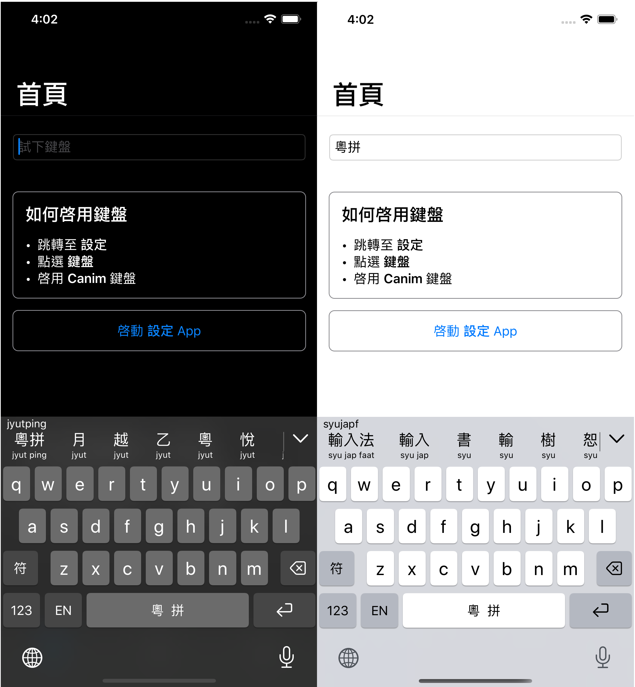

# Cantonese Keyboard for iOS

**Canim** stands for **Can**tonese **I**nput **M**ethod

https://yuetyam.github.io

## Now available on the App Store

 
 

 

## Screenshots

 
 

## Running compatibility
iOS 13+

## How to build
### Requirements
- Xcode 11.4+

### Build
Just open in Xcode and build
